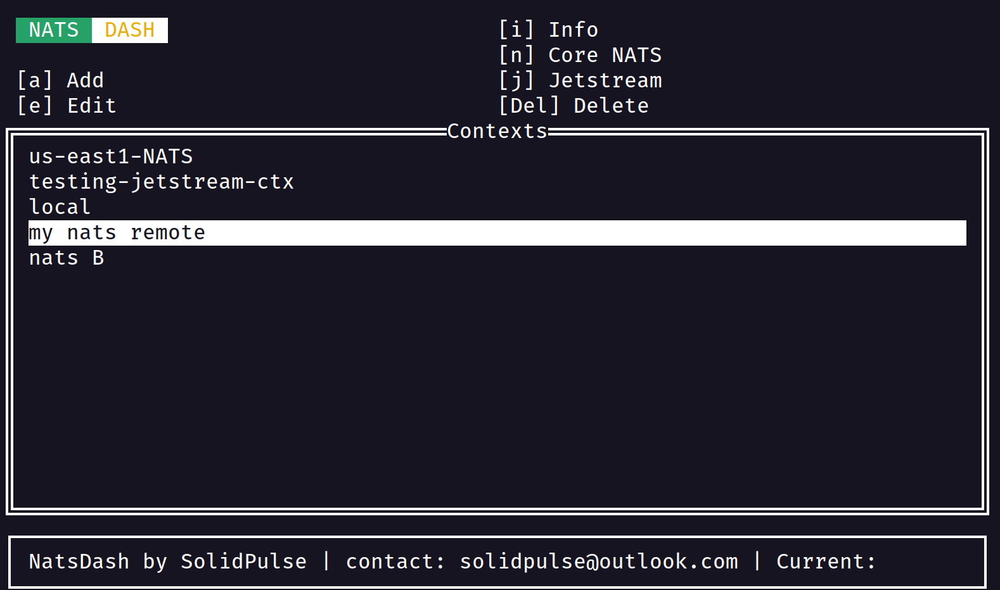
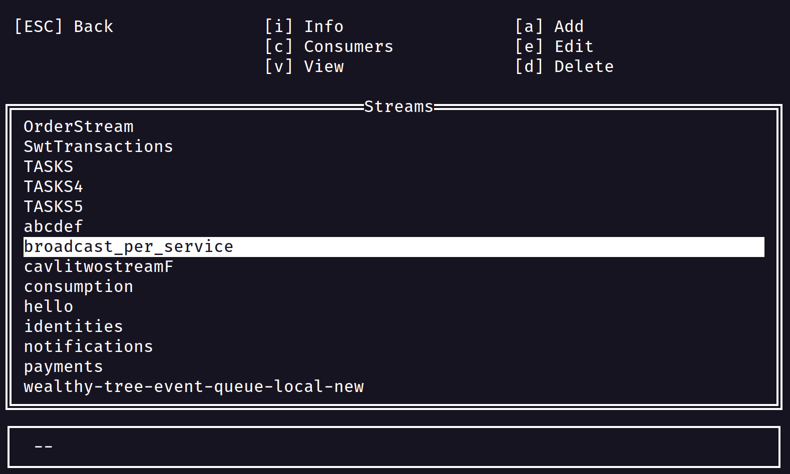
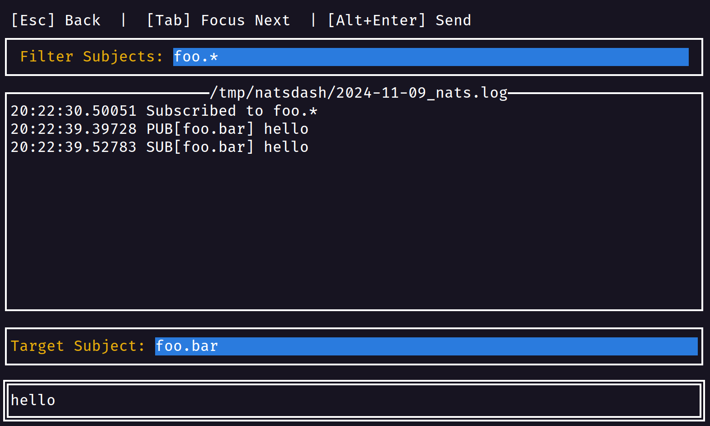
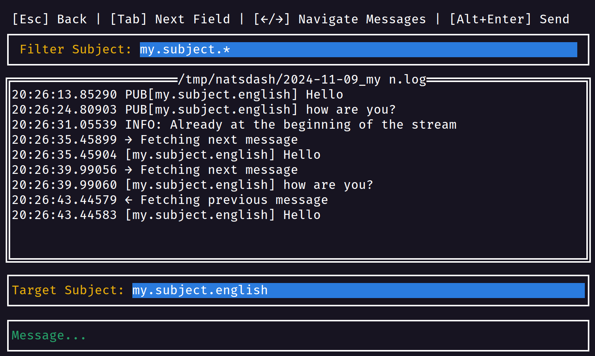
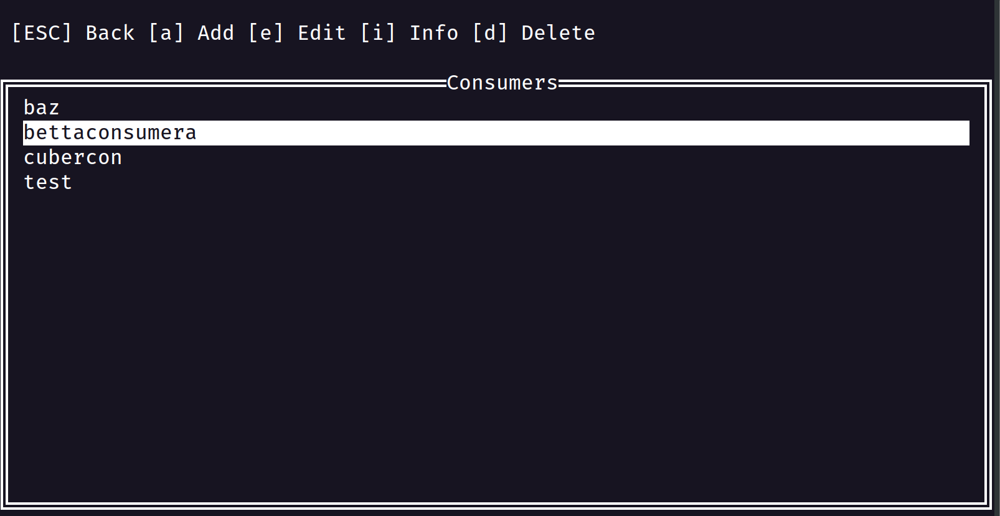

# NatsDash - A Simple GUI for NATS/JetStream

## Introduction


[Watch the demo on asciinema](https://asciinema.org/a/687282)

NatsDash is an intuitive dashboard/GUI for NATS designed to manage and monitor NATS servers. It provides a user-friendly interface to interact with NATS, making it easier to manage subscriptions, publish messages, and work with JetStream.

## Features Overview


*Manage multiple NATS server connections with easy context switching*


*View and manage all your JetStream streams in one place*


*Interact with NATS Core functionality, such as publishing and subscribing*


*Real-time message monitoring with subject filtering and grep capabilities*


*Create new JetStream consumers and manage existing ones*


# NatsDash Installer

## Installation

To install the latest version of NatsDash, you can use the provided `install.sh` script. This script automatically fetches the latest version from the remote `info.env` file and downloads the appropriate binary for your operating system and architecture.

### Usage

1. Make sure you have `curl` installed on your system.
2. Run the `install.sh` script:

   ```bash
   ./install.sh
   ```

   Alternatively, you can use `curl | bash` to directly install NatsDash:

   ```bash
   curl -sSL https://raw.githubusercontent.com/solidpulse/natsdash/refs/heads/master/install.sh | bash
   ```

3. The script will download the binary and make it executable.

## Direct Downloads

For manual installation or for specific versions, you can download the binaries directly from the [Releases section](https://github.com/solidpulse/natsdash/releases).

### Available Platforms

- macOS (arm64, x64)
- Linux (arm64, x64)
- Windows (x64)

## Support

For any issues or questions, please raise an issue or reach out to me at solidpulse@outlook.com
